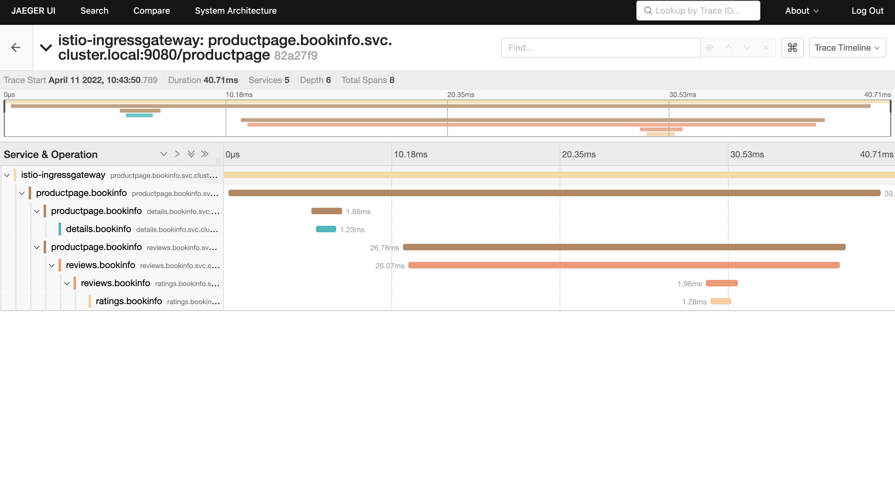

# Provision BookInfo

### BookInfo Overview

Bookinfo is a sample microservice architecture application that we’ll be using for our workshop.The application provides details about the book such as publisher details, overview, reviews and ratings through the microservices. The BookInfo Application is deployed to bookinfo namespace

### Deploy BookInfo

1. Create new project with the name 'bookinfo'

```yml
oc new-project bookinfo
```
2. By creating a ServiceMeshMemberRoll resource and specifying the namespaces where your content is located, we can add applications, workloads, or services to your mesh .

3. Create a Custom Resource Definition file for the Control Plane with name ServiceMeshMemberRoll_default.yaml using vim or any other editor on the CLI. Copy paste the below yaml into the file and save it.

```yml
apiVersion: maistra.io/v1
kind: ServiceMeshMemberRoll
metadata:
  name: default
spec:
  members:
    - bookinfo
```   
 
4. Apply the CRD to your cluster using the below command

```yml
oc apply -f ServiceMeshMemberRoll_default.yaml -n istio-system
```

5. Provision the application by using the below commands.

```yml
oc apply -f https://raw.githubusercontent.com/maistra/istio/maistra-2.1/samples/bookinfo/platform/kube/bookinfo.yaml -n bookinfo
oc apply -f https://raw.githubusercontent.com/maistra/istio/maistra-2.1/samples/bookinfo/networking/bookinfo-gateway.yaml -n bookinfo
```

6. You can now verify that the bookinfo service is responding by using reqbin.

7. Open a browser window and navigate to:

```yml
https://reqbin.com/curl
```

8. Copy and paste the below command.

```yml
curl -v http://istio-ingressgateway-istio-system.%CLUSTER_WILDCARD_URL%/productpage
```

If the CLuster URL is not populated, you can also retrieve the cluster wildcard url using the below command

```yml
oc get ingresscontroller default -n openshift-ingress-operator -o json | jq -r '.status.domain'
```
9. You should see 200 (OK) status


10. Send the request 10 times to the product page to generate traffic

11. Open the Kiali Console with URL given below and login using your OpenShift Cluster Credentials given to you as a part of your welcome email.

```yml
https://kiali-istio-system.%CLUSTER_WILDCARD_URL%
```

12. Navigate to Graph and Select all Namespaces


13. You should be able to see the traffic from istio-gateway to the bookinfo application as shown below:


> [!NOTE]
> If you are unable to see the traffic go back to the reqbin browser
and generate more traffic (Repeat steps 7 & 8)

14. You can also trace the calls using Jaeger if you choose to. Open the Jaeger Console with URL given below and login using your OpenShift Cluster Credentials given to you as a part of your welcome email.

```yml
https://jaeger-istio-system.%CLUSTER_WILDCARD_URL%
```

15. Chose Allow selected permissions


16. Select the productpage.bookinfo service and click on 'Find Traces'


17. Click on any of the search results and you should be able to find the traces as shown in the image below


