# Configuring 3Scale Product

### 3scale Product Overview

A 3scale product is a customer facing API. Products facilitate the creation of strong and simplified offerings for API consumers. In this section we will configure a 3scale product. Later we will use the Istio Ingress to the BookInfo application (created in the previous step) directly as an API Product in 3scale, using the 3scale Istio WASM module

### Configuring a 3scale Product

1. Log into 3scale using the below URL.

```yml
https://3scale-admin.%CLUSTER_WILDCARD_URL%
```

2. You can retrieve the login credentials using the OpenShift Console UI. Select 3scale project and Navigate to Developer > Secrets and search for system-seed


3. From the system-seed secret you can retrieve the admin_access_token (we will use this later in our lab), admin_user, admin_password used to login to 3scale. Login to the 3scale admin portal by using the admin_user and admin_password.


4. Once you login to the 3scale admin portal, close the on boarding Wizard to land directly on the dashboard.

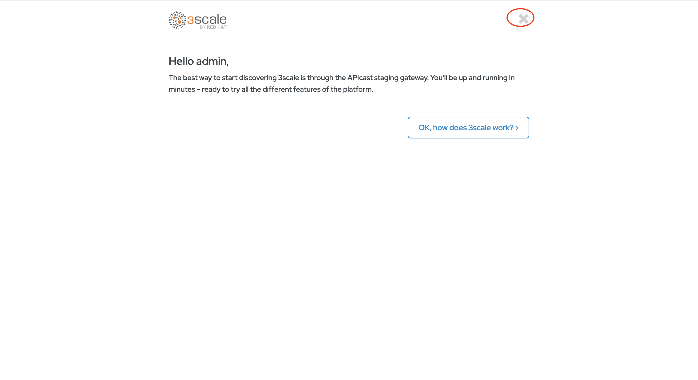

5. Click on Create Product

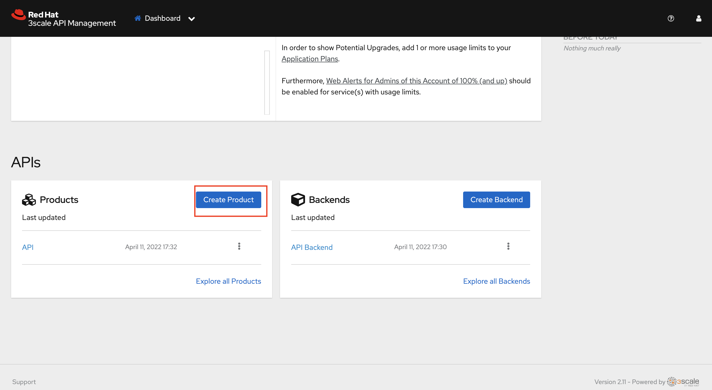

6. You can give the product any name. Let’s name the product wasm-demo and click on Create Product

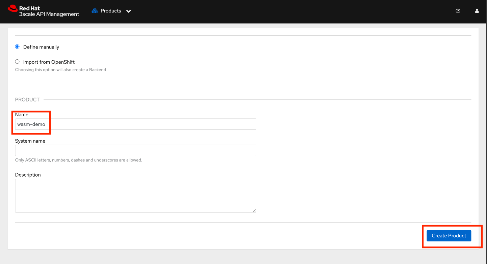

7. Go to Integration→Settings and choose Istio as the deployment. Click Update Product

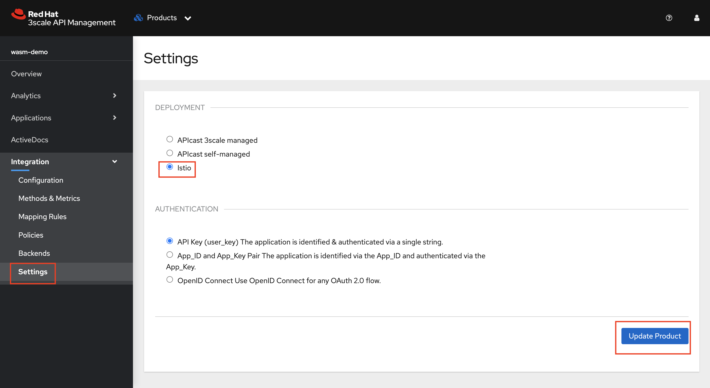

8. Go to Integration→Configuration. Click Update Configuration

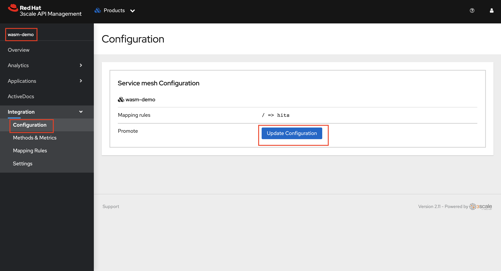

9. Go to Application > Application plans and Click Create Application Plan

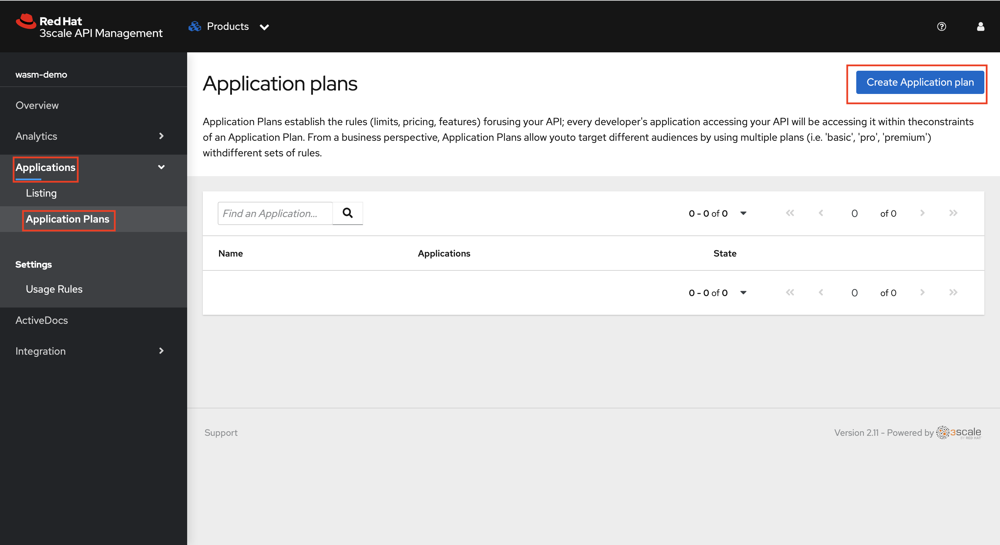

10. You can give the plan any name. Let’s name the plan wasm-basic and Click Create Application Plan

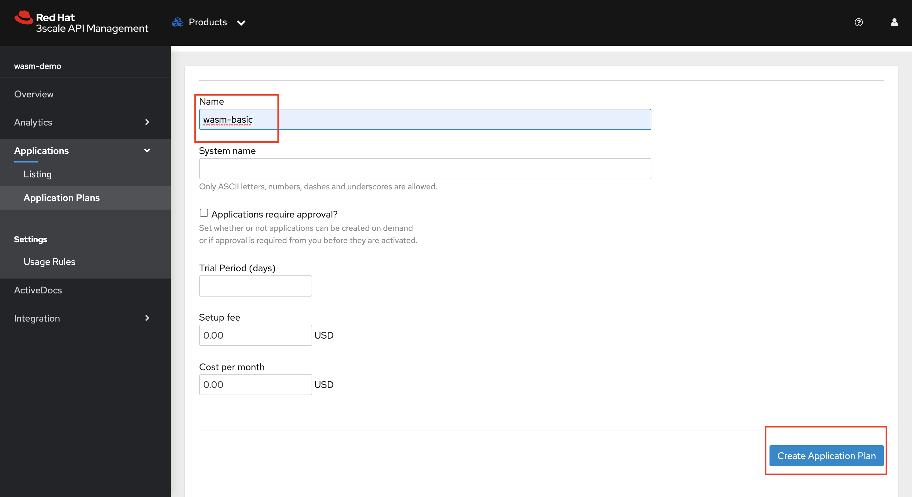

11. Click on the plan name to add rate limiting

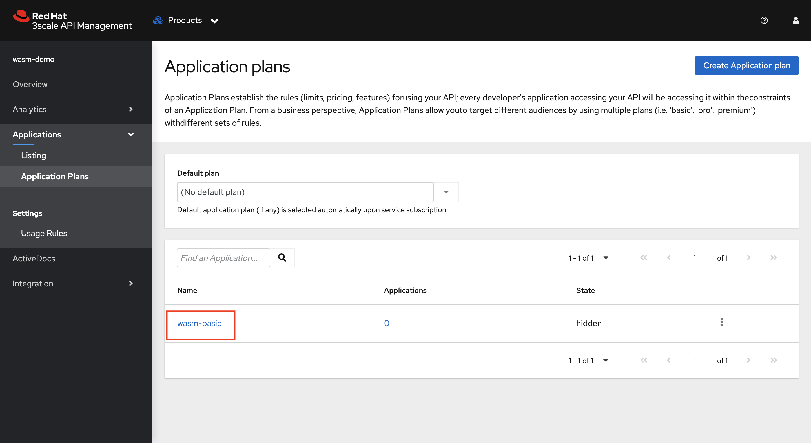

12. Scroll down and click on Limits and then on New usage limit


13. Select minute from the period and set the Max value as 8 .This means that users will be restricted to 8 call/min when they call the API . Click on create usage limit

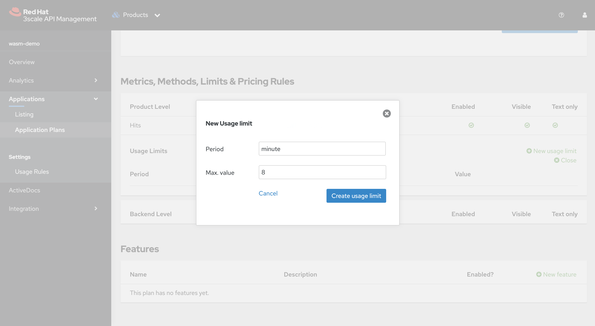

14. Scroll back up and click on Update Application Plan

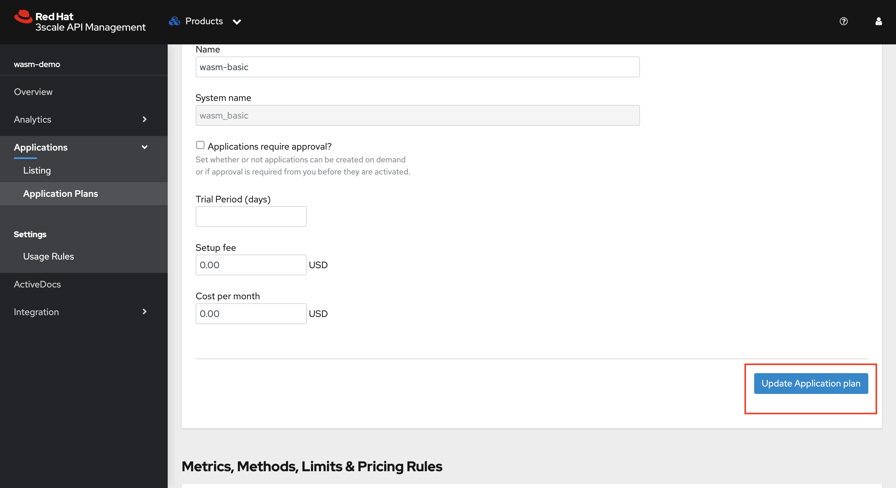

15. Click on the Kebab menu and publish the Application Plan.


16. Go to the Product Overview and take note of the ID given to the API (This will be used in later steps)

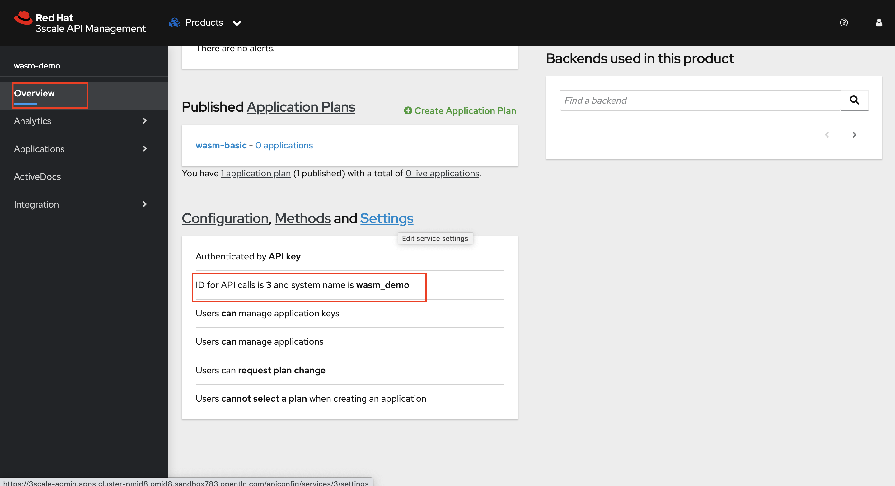
