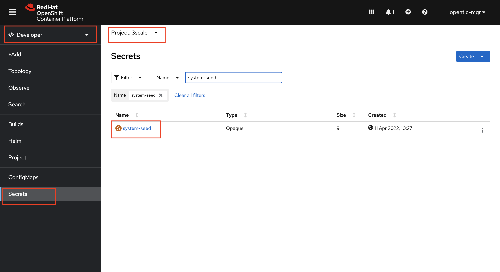
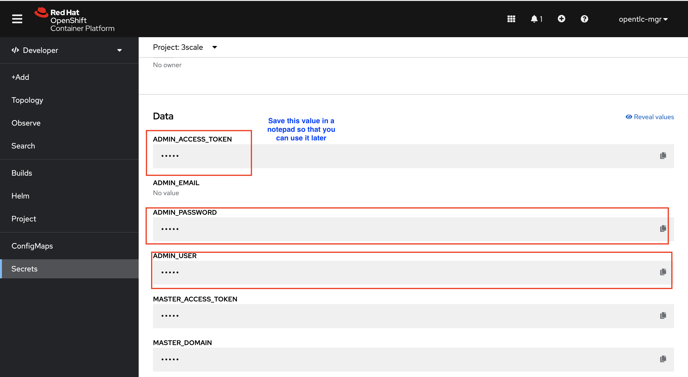
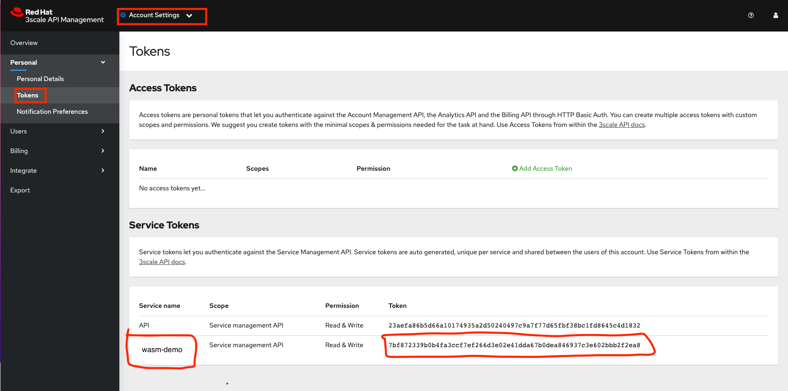
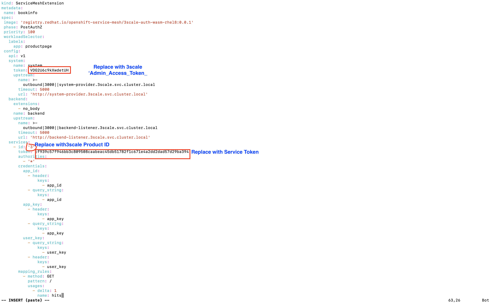
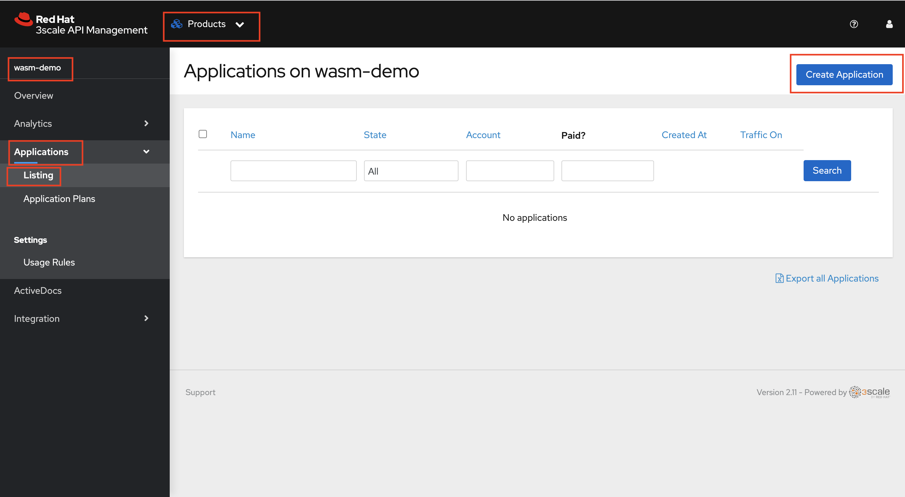
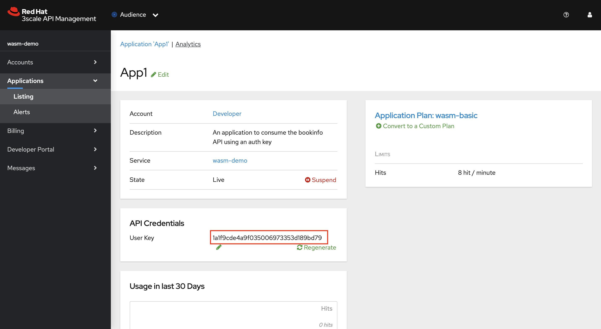
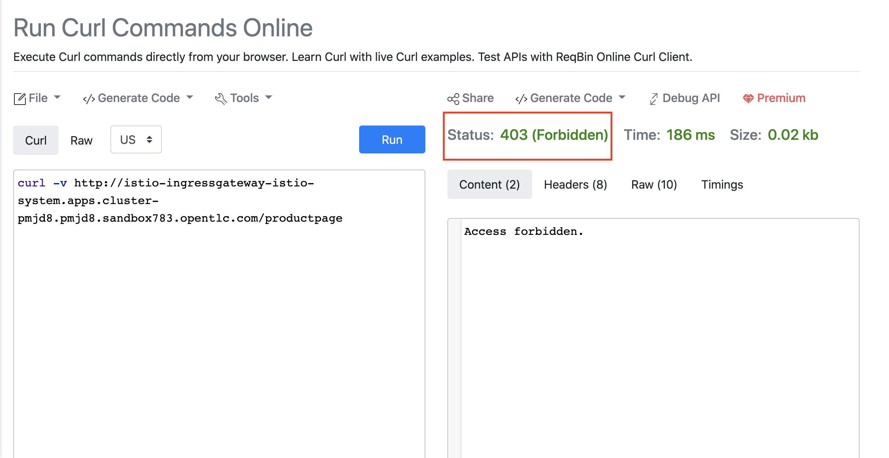
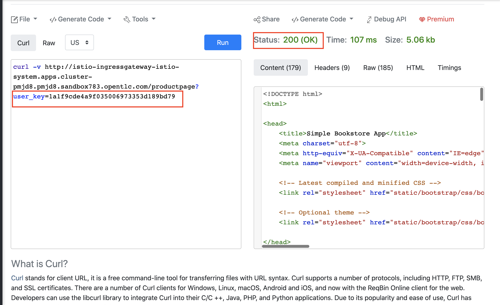

# Enable API Management for bookinfo

## Overview

In this section we shall enable the API management for bookinfo application using the 3scale WASM module

### Create Service Entry
To have the 3scale Web Assembly module authorize requests against 3scale, the module must have access to 3scale services. You can accomplish this within Red Hat OpenShift Service Mesh and Istio by applying an external ServiceEntry object.

The custom resources set up the service entries for access from within Service Mesh to 3scale for the backend and system components of the Service Management API and the Account Management API. The Service Management API receives queries for the authorization status of each request. The Account Management API provides API management configuration settings for your services.

1. Create a Custom Resource Definition file for the System Service Entry with name ServiceEntry_system-entry.yaml using vim or any other editor on the CLI. Copy paste the below yaml into the file and save it.

```yml
apiVersion: networking.istio.io/v1beta1
kind: ServiceEntry
metadata:
 name: system-entry
spec:
 hosts:
   - system-provider.3scale.svc.cluster.local
 location: MESH_EXTERNAL
 ports:
   - name: http
     number: 3000
     protocol: HTTP
 resolution: DNS

```

2. Create a Custom Resource Definition file for the Backend Service Entry with name ServiceEntry_backend-entry.yaml using vim or any other editor on the CLI. Copy paste the below yaml into the file and save it.

```yml
apiVersion: networking.istio.io/v1beta1
kind: ServiceEntry
metadata:
 name: backend-entry
spec:
 hosts:
   - backend-listener.3scale.svc.cluster.local
 location: MESH_EXTERNAL
 ports:
   - name: http
     number: 3000
     protocol: HTTP
 resolution: DNS
```

3. Apply the CRDs to your cluster using the below command

```yml
oc apply -f ServiceEntry_system-entry.yaml -f ServiceEntry_backend-entry.yaml -n bookinfo
```

### Create Service Mesh Extension

The ServiceMeshExtension custom resource spec provides the configuration that the Proxy-WASM module reads from. The spec is embedded in the host and read by the Proxy-WASM module. Follow the below steps to configure the ServiceMeshExtension

1. If you haven’t already noted down the 'Admin Access Token' from 3scale Secret from earlier labs please follow these steps. Retrieve the Admin_Access_token using the Console UI. Select 3scale project and Navigate to Developer > Secrets and search for system-seed



2. From the system-seed secret just copy and note down the the Admin_Access_Token



3. The service token will enable the permission for service mesh to be able to access a particular 3scale product. From the 3scale admin-portal navigate to Account Settings > Personal > Tokens and Copy the Service Token of the product we created earlier



> [!NOTE]
> Alternatively, you can also use 3scale admin access token along with the 3scale product ID from the 3scale product configuration earlier and run the following command with values replaced to obtain the Service token:
```yml
curl https://3scale-admin.%CLUSTER_WILDCARD_URL%/admin/api/services/{product id}/proxy/configs/production/latest.json?access_token={access token} | jq '.proxy_config.content.backend_authentication_value'
```
Copy and note down the Service Access Token obtained

4. Create a Custom Resource Definition file for the Service Mesh Extension with name ServiceMeshExtension_bookinfo.yaml using vim or any other editor on the CLI. Copy paste the below yaml into the file and replace the access token, service token, product id values as shown in the image below and save it.

```yml
apiVersion: maistra.io/v1
kind: ServiceMeshExtension
metadata:
 name: bookinfo
spec:
 image: 'registry.redhat.io/openshift-service-mesh/3scale-auth-wasm-rhel8:0.0.1'
 phase: PostAuthZ
 priority: 100
 workloadSelector:
   labels:
     app: productpage
 config:
   api: v1
   system:
     name: system
     token: VDG2U6c9kXwdetUH
     upstream:
       name: >-
         outbound|3000||system-provider.3scale.svc.cluster.local
       timeout: 5000
       url: 'http://system-provider.3scale.svc.cluster.local'
   backend:
     extensions:
       - no_body
     name: backend
     upstream:
       name: >-
         outbound|3000||backend-listener.3scale.svc.cluster.local
       timeout: 5000
       url: 'http://backend-listener.3scale.svc.cluster.local'
   services:
     - id: '3'
       token: cf939c57f946bb3c809508caabeac45db51782f1c671e4a2dd2dad57d29ba394
       authorities:
         - '*'
       credentials:
         app_id:
           - header:
               keys:
                 - app_id
           - query_string:
               keys:
                 - app_id
         app_key:
           - header:
               keys:
                 - app_key
           - query_string:
               keys:
                 - app_key
         user_key:
           - query_string:
               keys:
                 - user_key
           - header:
               keys:
                 - user_key
       mapping_rules:
         - method: GET
           pattern: /
           usages:
             - delta: 1
               name: hits
```


5. Apply the CRD to your cluster using the below command

```yml
oc apply -f ServiceMeshExtension_bookinfo.yaml -n bookinfo
```

We have now successfully manged the API with 3scale. Next we have to authorize an application to acess this API

### Authorize an application to consume the API managed

1. Login to 3scale and navigate to Products > wasm-demo > Applications > Listing and Click Create Application



2. Choose the default Developer Account, wasm-basic as Application Plan. Give any name and description to the application. Click on Create Application



3. You should now have an API user key that you can copy and use for authorization


### Verifying the policy enforcement

1. You can now verify the policy enforcement by first calling the endpoint without credentials and then later using the api key.

2. Open a browser window and navigate to:

```yml
https://reqbin.com/curl
```

3. Copy and paste the below command.

```yml
curl -v http://istio-ingressgateway-istio-system.%CLUSTER_WILDCARD_URL%/productpage
```
4. You should see a 403 status and we have not provided an api user key.



5. Now let’s append the api key and see what happens. Copy and paste the below command in reqbin. Do not forget to Replace the userkey.

```yml
curl -v http://istio-ingressgateway-istio-system.%CLUSTER_WILDCARD_URL%/productpage?user_key={user key}
```

6. You API call should be successful and should show a 200 HTTP response. If you make more than 8 calls per minute (recollect the limit we set in our application plans) you should see a 403 status. The count gets refreshed every minute



7. In case you want to verify the calls on Kiali and Jaeger you can send multiple calls via reqbin and check the paths and traces on the Kiali and Jaeger interfaces as illustrated earlier.