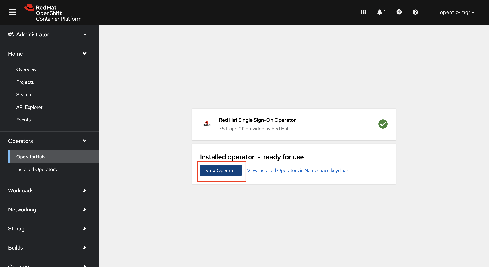
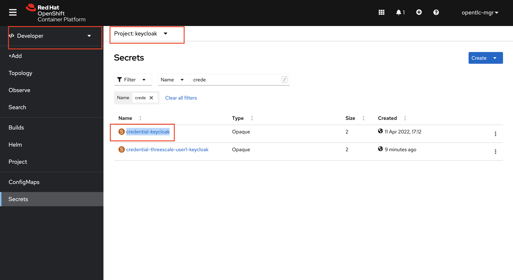
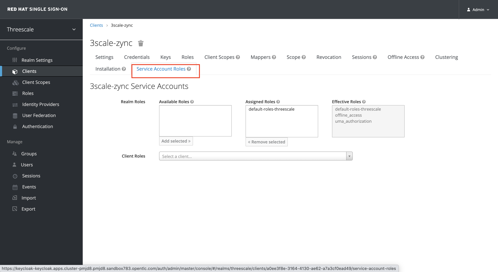

# Configuring Single Sign on


### Overview

In this section we will configure Red Hat SSO for setting up OIDC authentication for bookinfo APIs being managed in 3scale.

### Installing Red Hat SSO

1. Create a keycloak namespace on your OpenShift Cluster. Navigate to Administrator > Project > Create Project. Type keycloak as the name of the project and create.


2. On your OpenShift Console UI, navigate to Administrator > Operators > OperatorHub and search for sso. Select the Red Hat Single Sign-On Operator. Double check and make sure you are in the keycloak namespace while you do this


3. Click on Install


4. Double check and make sure the keycloak namespace is selected. Leave all the options as default and click Install


5. Once the installation is complete (will take a few seconds). Click on View Operator



6. Now let’s a Keycloak instance. Click on the Keycloak tab> Create Keycloak > YAML view >. Remove the the existing yaml and copy paste the code provided below

```yml
apiVersion: keycloak.org/v1alpha1
kind: Keycloak
metadata:
  name: keycloak
  labels:
    app: sso
spec:
  instances: 1
  extensions:
    - https://github.com/aerogear/keycloak-metrics-spi/releases/download/1.0.4/keycloak-metrics-spi-1.0.4.jar
  externalAccess:
    enabled: True
  profile: RHSSO
```


7. Navigate to Developer > Topology (Make sure you are in the keycloak project). Wait until all the pods are up and running i.e have a solid blue circle around them as shown below:


### Configuring the Keycloak Realm, Client and User

1. If you haven’t already done so, . Open the terminal on your workstation. SSH into the cluster bastion via the credentials you obtained in your welcome email which should look like the images below


2. Create a Custom Resource Definition file for the keycloak realm with name 'KeycloakRealm_threescale.yaml' using vim or any other editor on the CLI. Copy paste the below yaml into the file and save it.

```yml
apiVersion: keycloak.org/v1alpha1
kind: KeycloakRealm
metadata:
  name: threescale
  labels:
    app: threescale
spec:
  realm:
    id: threescale
    realm: threescale
    enabled: True
    displayName: "Red Hat 3scale Realm"
  instanceSelector:
    matchLabels:
      app: sso
```

3. Apply the CRD to your cluster using the below command

```yml
oc apply -f KeycloakRealm_threescale.yaml -n keycloak
```

4. Create a Custom Resource Definition file for the keycloak client with name 'KeycloakClient_3scale-zync.yaml' using vim or any other editor on the CLI. Copy paste the below yaml into the file and save it.

```yml
apiVersion: keycloak.org/v1alpha1
kind: KeycloakClient
metadata:
  name: 3scale-zync
  labels:
    app: threescale
spec:
  client:
    clientId: 3scale-zync
    secret: zync-secret
    clientAuthenticatorType: client-secret
    protocol: openid-connect
    directAccessGrantsEnabled: false
    standardFlowEnabled: false
    serviceAccountsEnabled: true
    defaultClientScopes:
      - email
      - profiles
      - roles
      - web-origins
  realmSelector:
    matchLabels:
      app: threescale
```

5. Apply the CRD to your cluster using the below command

```yml
oc apply -f KeycloakClient_3scale-zync.yaml -n keycloak
```

6. Create a Custom Resource Definition file for the keycloak user with name 'KeycloakUser_user1.yaml' using vim or any other editor on the CLI. Copy paste the below yaml into the file and save it.

```yml
apiVersion: keycloak.org/v1alpha1
kind: KeycloakUser
metadata:
  name: user1
  labels:
    app: threescale
spec:
  user:
    username: user1
    email: user1@openshift.opentlc.com
    enabled: true
    emailVerified : true
    credentials:
      - type: password
        value: openshift
    clientRoles:
      account:
        - manage-account
        - view-profile
      realm-management:
        - manage-clients
        - manage-users
        - manage-realm
        - realm-admin
  realmSelector:
    matchLabels:
      app: threescale
```

7. Apply the CRD to your cluster using the below command

```yml
oc apply -f KeycloakUser_user1.yaml -n keycloak
```

### Add service account permissions in Red Hat SSO UI

1. Log into Red Hat SSO UI using the below URL.

```yml
https://keycloak-keycloak.%CLUSTER_WILDCARD_URL%
```

2. Click on Administration Console


3. You can retrieve the login credentials using the OpenShift Console UI. Select keycloak project and Navigate to Developer > Secrets and search for credential-keycloak



4. From the credential-keycloak secret you can retrieve the admin login username and password Login to the Red Hat SSO admin portal by using the Username and Password


5. Double check to make sure you are in the Threescale realm


6. Browse to Clients and select the 3scale-zync client


7. Select the Service Account Roles tab



8. Select realm-management from the Client Roles dropdown


9. Select manage-clients from the Available Roles and Click on Add Selected to add it to Assigned Roles


After completion please proceed to next section:

