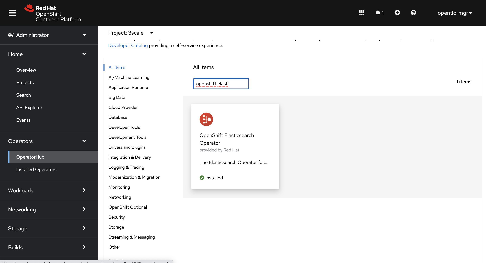
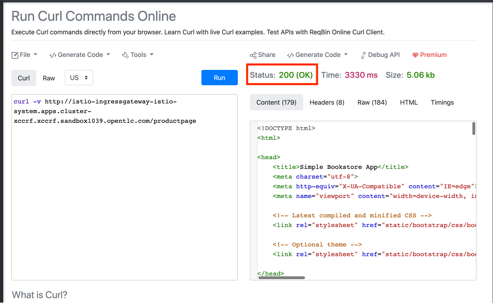
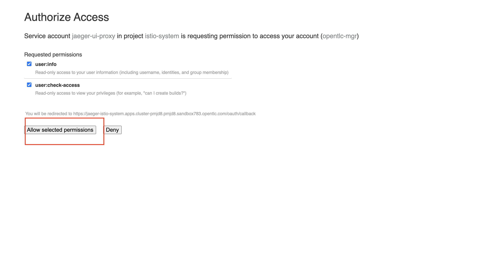
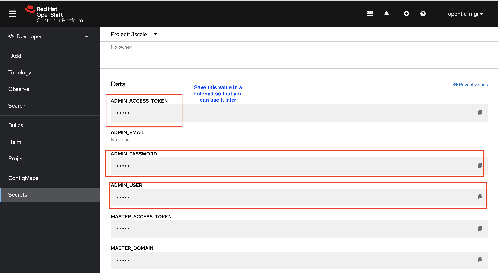
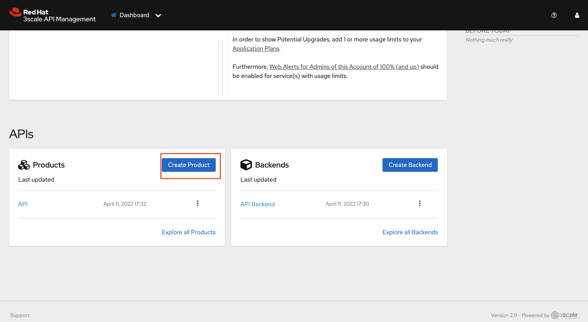
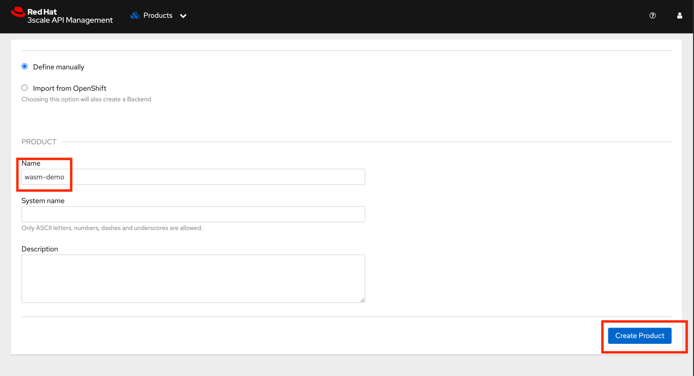
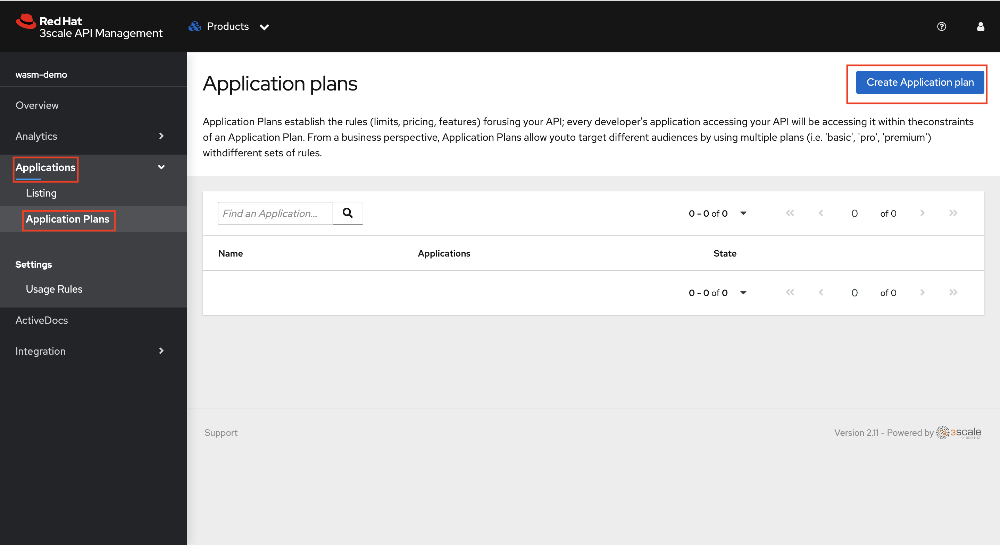
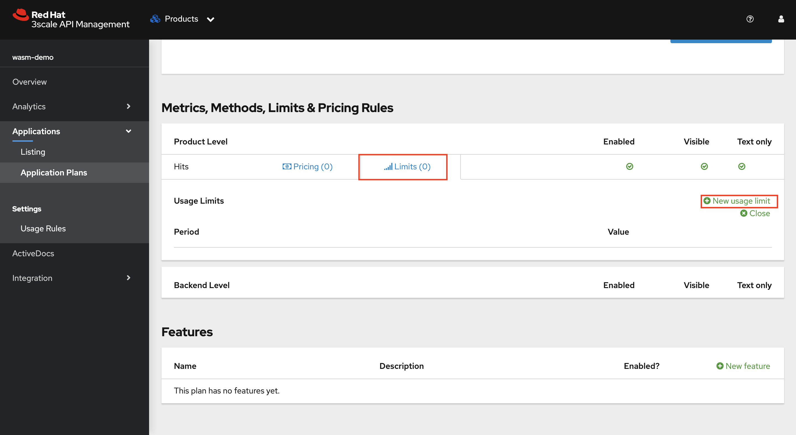
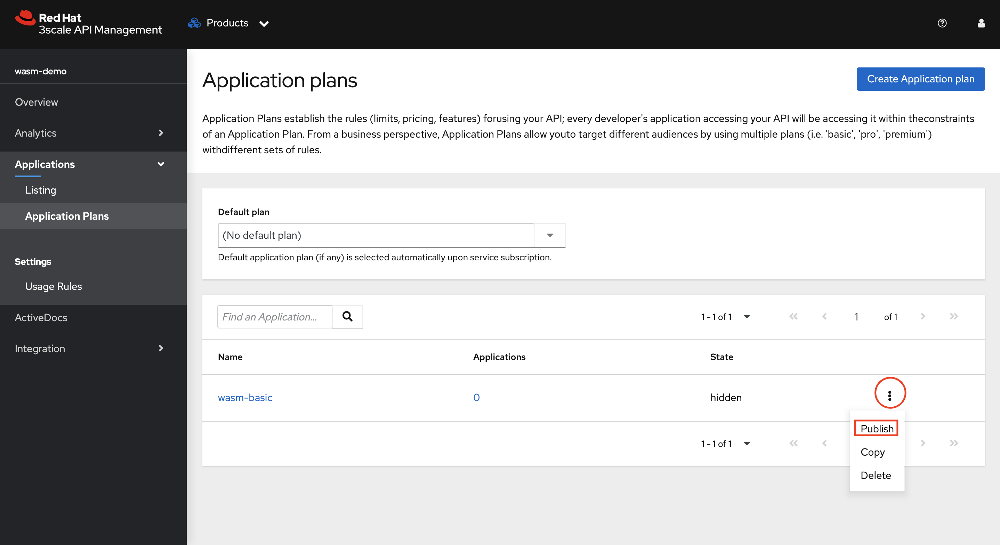
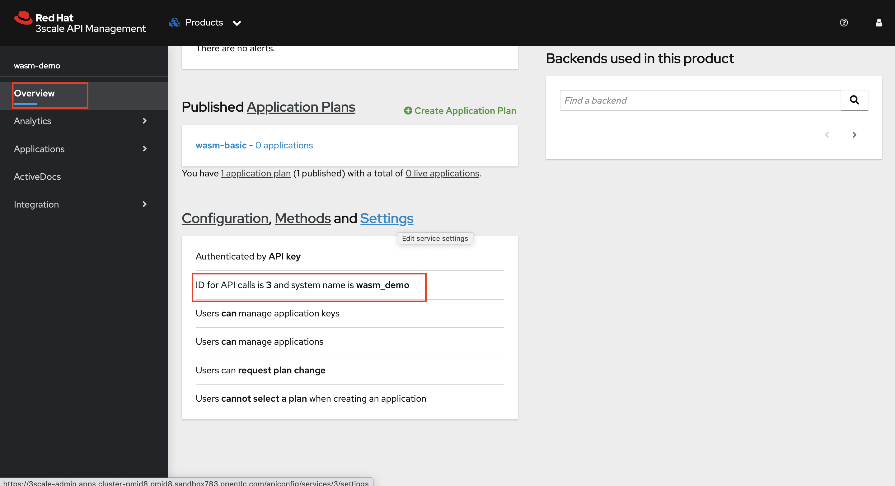

# Overview

In a Micro Services Architecture (MSA), there are different stakeholders for API Management and Service Mesh capabilities. Service Mesh provides observability, traceability, security and control to application develops and dev-ops engineers to monitor intra-service communications.

API management provides API providers and business owners ability to provide business API capabilities like security, rate limiting, billing and developer ecosystem.

## Installation Steps
You are provided with an OpenShift Container Platform 4.9 environment and will perform all the below actions as a part of this lab (For internal Red Hat folks please order an OCP 4.9 cluster from RHPDS)

- Installing 3scale

- Installing OpenShift Service Mesh

- Configuring Service Mesh

- Provisioning the BookInfo product (microservices) behind Istio gateway

- Configuring 3scale

- Enabling API Management


# Part 1

## Authentication Using API Key

In the part1 of this demo we shall use API_Key as a method of authentication. Before you proceed please type your OpenShift Cluster Wildcard DNS in the box above. You can pick it up from the URL of your Console UI.


The above step is the most important for this lab. The OpenShift Cluster Wildcard DNS should ideally look something like this. apps.cluster-pmjd8.pmjd8.sandbox783.opentlc.com .

## Setup

### Prerequisties

3scale requires a RWX storage for the developer portal. We will leverage the OpenShift Data Foundation for this. The OpenShift Data Foundation needs atleast 3 worker nodes (is they are not configured on your cluster already, please follow the below steps)

### Increase Worker Node Count

1. On your OpenShift Console UI, navigate to Administrator > Compute > Machine Sets and increase the machine count to 3 as shown below


2. Give it a few seconds to confirm the node is up and running


## ODF Installation

The whole lab is going to leverage Operators for installation of all the components. Users can configure the operators either via cli or console.

1. On your OpenShift Console UI, navigate to Administrator > Operators > OperatorHub and search for OpenShift Data Foundation. Leave all the values as Default and click on install.


The operator installation might take a minute or two

2. Wait for the operator to install and when you see the below screen, click on Create StorageSystem


3. Make sure the gp2 StorageClass is selected and click Next


4. Select all the three nodes and leave all the other values as default. Click Next


5. Leave all the values as default. Click Next


6. Click on Create StorageSystem


## 3scale Installation

1. Create a 3scale namespace on your OpenShift Cluster. Navigate to Administrator > Project > Create Project. Type 3scale as the name of the project and create.


2. On your OpenShift Console UI, navigate to Administrator > Operators > OperatorHub and search for 3scale. Select the Red Hat Integration Operator - 3scale. Double check and make sure you are in the 3scale namespace while you do this


3. Click on Install


4. Double check and make sure the 3scale namespace is selected. Leave all the options as default and click Install


5. Once the installation is complete (will take a few seconds). Click on View Operator


6. Now let’s create the API manager. Deploying the APIManager custom resource will make the operator begin processing and will deploy a 3scale solution from it.
7. Click on the API Manager tab > Create APIManager > YAML view >. Remove the the existing yaml and copy paste the code provided in step 3 as shown below


```yml
apiVersion: apps.3scale.net/v1alpha1
kind: APIManager
metadata:
  name: 3scale
spec:
  system:
    fileStorage:
      persistentVolumeClaim:
        storageClassName: ocs-storagecluster-cephfs
    redisResources:
      limits:
        memory: 6Gi
  backend:
    redisResources:
      limits:
        memory: 6Gi
  wildcardDomain: %CLUSTER_WILDCARD_URL%
```

If the Cluster WildCard URL is not populated already in the above yaml, please enter it the respective text box above. You can find the cluster wildcard url dns of your OpenShift cluster from the Console URL. Make a note of the cluster wildcard url as it’ll be useful later


Illustration of the above process


## Service Mesh Setup

### Service Mesh Control Plane Overview

We will be installing Elasticsearch, Jaeger, and Kiali for tracing and monitoring purposes.

### Elastic Search Operator Installation

1. On your OpenShift Console UI, navigate to Administrator > Operators > OperatorHub and search for OpenShift Elastic Operator. Select the Operator and Click Install.


1. Leave all the values as Default and click on install. Double check if the 'All namespaces' radio button is checked.


### Jaeger Operator Installation

1. Repeat the process for Jaeger Operator. On your OpenShift Console UI, navigate to Administrator > Operators > OperatorHub and search for Red Hat OpenShift distributed tracing platform. Select the Operator and Click Install


1. Leave all the values as Default and click on install. Double check if the 'All namespaces' radio button is checked.


## OpenShift Service Mesh Operator Installation

1. Repeat the process for Service Mesh Operator. On your OpenShift Console UI, navigate to Administrator > Operators > OperatorHub and search for Red Hat OpenShift Service Mesh. Select the Operator and Click Install


2. Leave all the values as Default and click on install. Double check if the 'All namespaces' radio button is checked. Wait for the operator installation to complete


After all you have installed all four Operators, click Operators → Installed Operators to verify that your Operators installed

## Create Control Plane

The control plane manages and configures the proxies that make up the data plane. It is the authoritative source for configuration, manages access control and usage policies, and collects metrics from the proxies in the service mesh. You can deploy a basic ServiceMeshControlPlane by using the web console or CLI. We will be using the CLI for our demo.

1. Open the terminal on your workstation. SSH into the cluster bastion via the credentials you obtained in your welcome email which should look like the images below

2. Create new project with the name 'istio-system'

```yml
oc new-project istio-system
```


3. Create a Custom Resource Definition file for the Control Plane with name ServiceMeshControlPlane_basic.yaml using vim or any other editor on the cli. Copy paste the below yaml into the file and save it.

```yml
apiVersion: maistra.io/v2
kind: ServiceMeshControlPlane
metadata:
  name: basic
spec:
  addons:
    grafana:
      enabled: true
    jaeger:
      install:
        storage:
          type: Memory
    kiali:
      enabled: true
    prometheus:
      enabled: true
  policy:
    type: Istiod
  profiles:
    - default
  telemetry:
    type: Istiod
  tracing:
    sampling: 10000
    type: Jaeger
  version: v2.1
```

Apply the CRD to your cluster using the below command


```yml
oc apply -f ServiceMeshControlPlane_basic.yaml -n istio-system
```

# Provision BookInfo

### BookInfo Overview

Bookinfo is a sample microservice architecture application that we’ll be using for our workshop.The application provides details about the book such as publisher details, overview, reviews and ratings through the microservices. The BookInfo Application is deployed to bookinfo namespace

### Deploy BookInfo

1. Create new project with the name 'bookinfo'

```yml
oc new-project bookinfo
```
2. By creating a ServiceMeshMemberRoll resource and specifying the namespaces where your content is located, we can add applications, workloads, or services to your mesh .

3. Create a Custom Resource Definition file for the Control Plane with name ServiceMeshMemberRoll_default.yaml using vim or any other editor on the CLI. Copy paste the below yaml into the file and save it.

```yml
apiVersion: maistra.io/v1
kind: ServiceMeshMemberRoll
metadata:
  name: default
spec:
  members:
    - bookinfo
```   
 
4. Apply the CRD to your cluster using the below command

```yml
oc apply -f ServiceMeshMemberRoll_default.yaml -n istio-system
```

5. Provision the application by using the below commands.

```yml
oc apply -f https://raw.githubusercontent.com/maistra/istio/maistra-2.1/samples/bookinfo/platform/kube/bookinfo.yaml -n bookinfo
oc apply -f https://raw.githubusercontent.com/maistra/istio/maistra-2.1/samples/bookinfo/networking/bookinfo-gateway.yaml -n bookinfo
```

6. You can now verify that the bookinfo service is responding by using reqbin.

7. Open a browser window and navigate to:

```yml
https://reqbin.com/curl
```

8. Copy and paste the below command.

```yml
curl -v http://istio-ingressgateway-istio-system.%CLUSTER_WILDCARD_URL%/productpage
```

If the CLuster URL is not populated, you can also retrieve the cluster wildcard url using the below command

```yml
oc get ingresscontroller default -n openshift-ingress-operator -o json | jq -r '.status.domain'
```
9. You should see 200 (OK) status


10. Send the request 10 times to the product page to generate traffic

11. Open the Kiali Console with URL given below and login using your OpenShift Cluster Credentials given to you as a part of your welcome email.

```yml
https://kiali-istio-system.%CLUSTER_WILDCARD_URL%
```

12. Navigate to Graph and Select all Namespaces


13. You should be able to see the traffic from istio-gateway to the bookinfo application as shown below:


> [!NOTE]
> If you are unable to see the traffic go back to the reqbin browser
and generate more traffic (Repeat steps 7 & 8)

14. You can also trace the calls using Jaeger if you choose to. Open the Jaeger Console with URL given below and login using your OpenShift Cluster Credentials given to you as a part of your welcome email.

```yml
https://jaeger-istio-system.%CLUSTER_WILDCARD_URL%
```

15. Chose Allow selected permissions



16. Select the productpage.bookinfo service and click on 'Find Traces'


17. Click on any of the search results and you should be able to find the traces as shown in the image below


# Configuring 3Scale Product

### 3scale Product Overview

A 3scale product is a customer facing API. Products facilitate the creation of strong and simplified offerings for API consumers. In this section we will configure a 3scale product. Later we will use the Istio Ingress to the BookInfo application (created in the previous step) directly as an API Product in 3scale, using the 3scale Istio WASM module

### Configuring a 3scale Product

1. Log into 3scale using the below URL.

```yml
https://3scale-admin.%CLUSTER_WILDCARD_URL%
```

2. You can retrieve the login credentials using the OpenShift Console UI. Select 3scale project and Navigate to Developer > Secrets and search for system-seed


3. From the system-seed secret you can retrieve the admin_access_token (we will use this later in our lab), admin_user, admin_password used to login to 3scale. Login to the 3scale admin portal by using the admin_user and admin_password.



4. Once you login to the 3scale admin portal, close the on boarding Wizard to land directly on the dashboard.


5. Click on Create Product



6. You can give the product any name. Let’s name the product wasm-demo and click on Create Product



7. Go to Integration→Settings and choose Istio as the deployment. Click Update Product


8. Go to Integration→Configuration. Click Update Configuration


9. Go to Application > Application plans and Click Create Application Plan



10. You can give the plan any name. Let’s name the plan wasm-basic and Click Create Application Plan


11. Click on the plan name to add rate limiting


12. Scroll down and click on Limits and then on New usage limit



13. Select minute from the period and set the Max value as 8 .This means that users will be restricted to 8 call/min when they call the API . Click on create usage limit


14. Scroll back up and click on Update Application Plan


15. Click on the Kebab menu and publish the Application Plan.



16. Go to the Product Overview and take note of the ID given to the API (This will be used in later steps)


